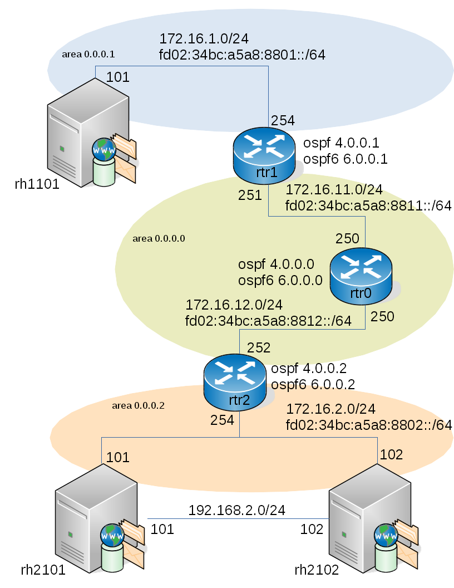
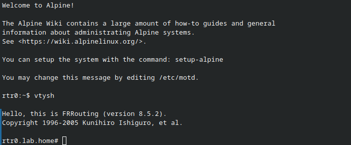
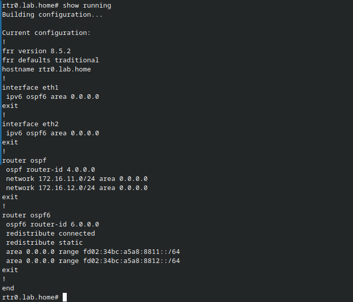
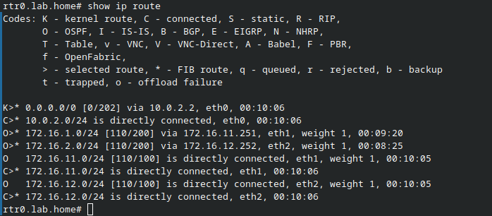
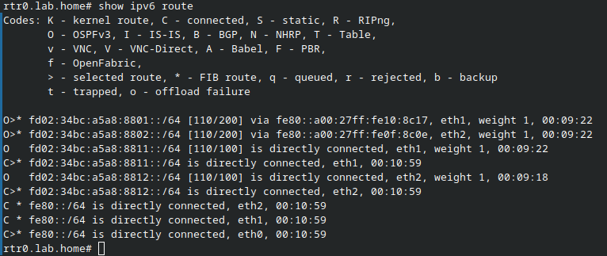

# vagrant_ffrouting

## Description

This is a lab configuration for testing firewall, VPN installation, etc, using Free Range Routing (https://frrouting.org/). The vagrant file builds the following OSPF (just because) based network to simulate an Internet. The idea is that the RedHat (using AlmaLinux) machine rh1101 is an external machine, rh2101 and rh2102 are border/internal machines. Or, if you need to test restricting to an external source, rh1101 becomes the border, rh2101 and rh2102 become the externals. This also works as a router configuration lab/test environment.



To keep the resource usage to a minimum, it uses Alpine Linux for the FRRouting routers. The routing protocol is OSPF, routing both IPv4 and IPv6.

## Requirements

- VirtualBox https://www.virtualbox.org/
- vagrant https://www.vagrantup.com/

## Usage

```
vagrant up
vagrant ssh rh1101
ssh rh2102v6  # connect using ipv6
ssh rh2102    # connect using ipv4
```

### Using FRRouting

```
vagrant ssh rtr0
vtysh
```


```
show running
```


```
show ip route
```


```
show ipv6 route
```



> 'exit' to exit from vtysh
